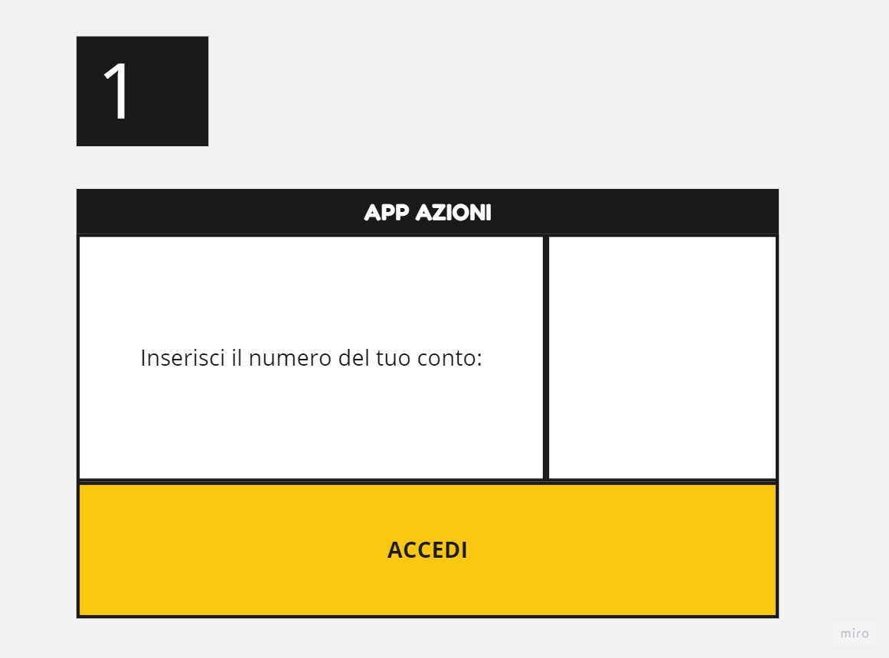

Scopo: gestire titoli di una banca. 
Classi:
 - Banca, che banalmente ha le funzioni di una banca;
 - ContoCorrente, per gestire i vari conti;
 - Titolo, che è un titolo bancario;
 - Record, salva l'andamento delle azioni,
 - Borsa, che è una piattaforma di scambio dove gli investitori possono comprare e vendere titoli finanziari .
 
------------------------------------------
COMPITO 1:
1. L'utente chiede alla borsa di mettere in vendita le azioni;
2. La borsa le mette sul mercato;
3. Se c'è una richiesta e va tutto a buon fine, vengono aggiunti i soldi sul conti dell'utente.

------------------------------------------
COMPITO 2:
1. Diagramma delle classi - rappresenta le classi che utilizzeremo, e i loro metodi e attributi.

2. Casi d'uso - nella seguente immagine viene riportato come il sistema interagisce con gli actors, tralasciando i dettagli di come vengono implementate le funzioni.

3. Schema UML dinamico - invece, in questa immagine viene spiegato come gli oggetti comunicano in ordine nel tempo.

------------------------------------------
COMPITO 3:
1. Nella prima parte l'utente dovrà loggarsi (il login non è ancora chiaro con cosa avverrà, e per ora ho messo solo il numero del conto).

2. Dopo essersi loggato, si troverà nella schermata che mostra all'utente le sue azioni. 

3. Cliccando su mostra azioni, all'utente verranno mostrate le azioni che sono presenti sulla borsa. 

4. Cliccando su una delle azioni mostrate a schermo, l'utente accederà a una schermata in cui verrà mostrata l'azione, e l'opzione per acquistarla.

5. Cliccando su 'Compra Ora' l'utente dovrà decidere quante azioni comprare. Può tornare indietro cliccando sulle due opzioni del menù 'Le tue azioni' e 'Mostra azioni'. Inoltre non potrà acquistare le azioni se non ha abbastanza soldi sul conto.

6. Se l'operazione va a buon fine, all'utente verrà mostrata la seguente schermata.

7. Se dovesse esserci un errore durante l'acquisto dell'azione, all'utente verrà mostrata la seguente schermata.

------------------------------------------
COMPITO 4:
Cliccare sul progetto 'Lab 501 - Trading' per vedere le classi.
